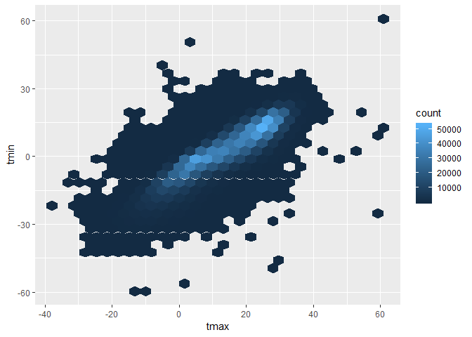

p8105\_hw3\_ks3663
================
Kee-Young Shin
October 10, 2018

Problem 1
---------

``` r
library(tidyverse)
```

    ## -- Attaching packages ---------------------------------------------- tidyverse 1.2.1 --

    ## v ggplot2 3.0.0     v purrr   0.2.5
    ## v tibble  1.4.2     v dplyr   0.7.6
    ## v tidyr   0.8.1     v stringr 1.3.1
    ## v readr   1.1.1     v forcats 0.3.0

    ## -- Conflicts ------------------------------------------------- tidyverse_conflicts() --
    ## x dplyr::filter() masks stats::filter()
    ## x dplyr::lag()    masks stats::lag()

``` r
library(p8105.datasets)


data("brfss_smart2010") # import data

filtered_brfss = brfss_smart2010 %>%
  janitor::clean_names() %>%
  select(year, locationabbr, locationdesc, topic, response, sample_size, data_value) %>%
  filter(topic == "Overall Health") %>% # filter based on overall health
  mutate(response_f = factor(response, levels = c("Excellent", "Very good", "Good", "Fair", "Poor"), ordered = TRUE)) # make column for factor variables 

levels(filtered_brfss$response_f)
```

    ## [1] "Excellent" "Very good" "Good"      "Fair"      "Poor"

``` r
class(filtered_brfss$response_f)
```

    ## [1] "ordered" "factor"

``` r
filtered_brfss
```

    ## # A tibble: 10,625 x 8
    ##     year locationabbr locationdesc topic response sample_size data_value
    ##    <int> <chr>        <chr>        <chr> <chr>          <int>      <dbl>
    ##  1  2010 AL           AL - Jeffer~ Over~ Excelle~          94       18.9
    ##  2  2010 AL           AL - Jeffer~ Over~ Very go~         148       30  
    ##  3  2010 AL           AL - Jeffer~ Over~ Good             208       33.1
    ##  4  2010 AL           AL - Jeffer~ Over~ Fair             107       12.5
    ##  5  2010 AL           AL - Jeffer~ Over~ Poor              45        5.5
    ##  6  2010 AL           AL - Mobile~ Over~ Excelle~          91       15.6
    ##  7  2010 AL           AL - Mobile~ Over~ Very go~         177       31.3
    ##  8  2010 AL           AL - Mobile~ Over~ Good             224       31.2
    ##  9  2010 AL           AL - Mobile~ Over~ Fair             120       15.5
    ## 10  2010 AL           AL - Mobile~ Over~ Poor              66        6.4
    ## # ... with 10,615 more rows, and 1 more variable: response_f <ord>

``` r
filtered_brfss %>%
  filter(year == "2002") %>%
  select(locationabbr, locationdesc) %>%
  distinct() %>%
  group_by(locationabbr) %>%
  summarize(count = n()) %>%
  filter(count == 7)
```

    ## # A tibble: 3 x 2
    ##   locationabbr count
    ##   <chr>        <int>
    ## 1 CT               7
    ## 2 FL               7
    ## 3 NC               7

``` r
# CT, FL, and NC were observed at 7 locations

locations_count = filtered_brfss %>%
  select(year, locationabbr, locationdesc) %>%
  distinct() %>% # distinct states
  group_by(year, locationabbr) %>%
  summarize(count = n()) # count number of locations
locations_count
```

    ## # A tibble: 443 x 3
    ## # Groups:   year [?]
    ##     year locationabbr count
    ##    <int> <chr>        <int>
    ##  1  2002 AK               1
    ##  2  2002 AL               1
    ##  3  2002 AR               1
    ##  4  2002 AZ               2
    ##  5  2002 CA               1
    ##  6  2002 CO               4
    ##  7  2002 CT               7
    ##  8  2002 DC               1
    ##  9  2002 DE               3
    ## 10  2002 FL               7
    ## # ... with 433 more rows

``` r
ggplot(locations_count, aes(x = year, y = count, color = locationabbr)) + 
  geom_line()
```


``` r
filtered_brfss %>%
  select(locationabbr, locationdesc, year, data_value, response) %>%
  filter(locationabbr == "NY", year %in% c(2002, 2006, 2010), 
         response == "Excellent") %>%
  group_by(year) %>%
  summarize(mean = mean(data_value), std = sd(data_value)) # show mean and std
```

    ## # A tibble: 3 x 3
    ##    year  mean   std
    ##   <int> <dbl> <dbl>
    ## 1  2002  24.0  4.49
    ## 2  2006  22.5  4.00
    ## 3  2010  22.7  3.57

``` r
filtered_brfss %>%
  filter(locationabbr == "NY", year %in% c(2002, 2006, 2010)) %>%
  select(locationabbr, locationdesc, year, response_f, sample_size) %>%
  spread(response_f, value = sample_size) %>%
  mutate(proportion_ex = Excellent / (Excellent + `Very good` + Good + Fair + Poor)) %>%
  group_by(year) %>%
  summarize(mean = mean(proportion_ex), std = sd(proportion_ex)) 
```

    ## # A tibble: 3 x 3
    ##    year  mean    std
    ##   <int> <dbl>  <dbl>
    ## 1  2002 0.248 0.0398
    ## 2  2006 0.218 0.0387
    ## 3  2010 0.203 0.0460

``` r
average_proportions = filtered_brfss %>%
  select(locationabbr, locationdesc, year, response_f, sample_size) %>%
  spread(response_f, value = sample_size) %>%
  mutate(total_sample = (Excellent + `Very good` + Good + Fair + Poor)) %>%
  mutate(proportion_ex = Excellent / total_sample, proportion_vg = `Very good` / total_sample, proportion_g = Good / total_sample, proportion_f = Fair / total_sample, proportion_p = Poor / total_sample) %>% # create column for averages
  group_by(year, locationabbr) %>% # group by year and location
  summarize(Excellent = mean(proportion_ex), `Very good` = mean(proportion_vg), Good = mean(proportion_g), Fair = mean(proportion_f), Poor = mean(proportion_p)) %>%
  ungroup() %>%
  gather(key = variable, value = value, 3:7) %>% # reorder dataset 
  mutate(factor_variable = factor(variable, levels = c("Excellent", "Very good", "Good", "Fair", "Poor"), ordered = TRUE)) %>% 
  arrange(factor_variable)

  
average_proportions
```

    ## # A tibble: 2,215 x 5
    ##     year locationabbr variable  value factor_variable
    ##    <int> <chr>        <chr>     <dbl> <ord>          
    ##  1  2002 AK           Excellent 0.279 Excellent      
    ##  2  2002 AL           Excellent 0.187 Excellent      
    ##  3  2002 AR           Excellent 0.237 Excellent      
    ##  4  2002 AZ           Excellent 0.238 Excellent      
    ##  5  2002 CA           Excellent 0.250 Excellent      
    ##  6  2002 CO           Excellent 0.227 Excellent      
    ##  7  2002 CT           Excellent 0.283 Excellent      
    ##  8  2002 DC           Excellent 0.313 Excellent      
    ##  9  2002 DE           Excellent 0.206 Excellent      
    ## 10  2002 FL           Excellent 0.258 Excellent      
    ## # ... with 2,205 more rows

``` r
ggplot(average_proportions, aes(x = year, y = value, group = year)) + geom_boxplot() + facet_wrap(~variable) 
```


Problem 2
---------

``` r
data("instacart") # import data

instacart
```

    ## # A tibble: 1,384,617 x 15
    ##    order_id product_id add_to_cart_ord~ reordered user_id eval_set
    ##       <int>      <int>            <int>     <int>   <int> <chr>   
    ##  1        1      49302                1         1  112108 train   
    ##  2        1      11109                2         1  112108 train   
    ##  3        1      10246                3         0  112108 train   
    ##  4        1      49683                4         0  112108 train   
    ##  5        1      43633                5         1  112108 train   
    ##  6        1      13176                6         0  112108 train   
    ##  7        1      47209                7         0  112108 train   
    ##  8        1      22035                8         1  112108 train   
    ##  9       36      39612                1         0   79431 train   
    ## 10       36      19660                2         1   79431 train   
    ## # ... with 1,384,607 more rows, and 9 more variables: order_number <int>,
    ## #   order_dow <int>, order_hour_of_day <int>,
    ## #   days_since_prior_order <int>, product_name <chr>, aisle_id <int>,
    ## #   department_id <int>, aisle <chr>, department <chr>

There are 131209 orders in this dataset and a total of 39123 products ordered. The average hour of the day at which people buy the products is 13.5775922, which shows many people shot during the evening hours.

``` r
distinct(instacart, aisle_id) 
```

    ## # A tibble: 134 x 1
    ##    aisle_id
    ##       <int>
    ##  1      120
    ##  2      108
    ##  3       83
    ##  4       95
    ##  5       24
    ##  6       21
    ##  7        2
    ##  8      115
    ##  9       53
    ## 10      123
    ## # ... with 124 more rows

``` r
# There are 134 different aisles. 

aisle_orders = instacart %>%
  group_by(aisle) %>%
  summarize(n = n()) %>%
  arrange(-n)
# The most items are ordered from fresh vegetables and fresh fruits. 

aisle_orders
```

    ## # A tibble: 134 x 2
    ##    aisle                              n
    ##    <chr>                          <int>
    ##  1 fresh vegetables              150609
    ##  2 fresh fruits                  150473
    ##  3 packaged vegetables fruits     78493
    ##  4 yogurt                         55240
    ##  5 packaged cheese                41699
    ##  6 water seltzer sparkling water  36617
    ##  7 milk                           32644
    ##  8 chips pretzels                 31269
    ##  9 soy lactosefree                26240
    ## 10 bread                          23635
    ## # ... with 124 more rows

``` r
aisle_orders$aisle = factor(aisle_orders$aisle, levels =
                              aisle_orders$aisle[order(aisle_orders$n)]) 

ggplot(aisle_orders, aes(x = aisle, y = n)) + 
  geom_point() + 
  theme(axis.text.x = element_text(angle = 90, hjust = 1)) # make plot of counts and put it in sensible order
```

 The plot shows that the number of items ordered from the aisles are mostly less than 25000. There are some outliers such as the two aisles that had above 150,000 orders (fresh fruits and fresh vegetables).

``` r
instacart %>%
  filter(aisle %in% c("dog food care", "baking ingredients", "packaged vegetables fruits")) %>% # filter by selected aisles 
  group_by(product_name, aisle) %>%
  summarize(count = n()) %>% # take count 
  ungroup() %>%
  group_by(aisle) %>%
  arrange(desc(count)) %>% # arrange count in descending order 
  slice(1) # show most ordered item 
```

    ## # A tibble: 3 x 3
    ## # Groups:   aisle [3]
    ##   product_name                               aisle                   count
    ##   <chr>                                      <chr>                   <int>
    ## 1 Light Brown Sugar                          baking ingredients        499
    ## 2 Snack Sticks Chicken & Rice Recipe Dog Tr~ dog food care              30
    ## 3 Organic Baby Spinach                       packaged vegetables fr~  9784

Light brown sugar, snack sticks chicken dog treats, and organic baby spinach were the three most popular items for aisles baking ingredients, dog food care, and packaged vegetables fruits, respectively. The count for the orders is the smallest for the dog treats, which would make sense because the population of people that would buy these treats is generally smaller than those that buy general food products.

``` r
instacart %>%
  filter(product_name %in% c("Pink Lady Apples", "Coffee Ice Cream")) %>% 
  group_by(product_name, order_dow) %>%
  summarize(mean_hour = mean(order_hour_of_day)) %>% # calculate mean 
  spread(order_dow, mean_hour) # spread days into columns 
```

    ## # A tibble: 2 x 8
    ## # Groups:   product_name [2]
    ##   product_name       `0`   `1`   `2`   `3`   `4`   `5`   `6`
    ##   <chr>            <dbl> <dbl> <dbl> <dbl> <dbl> <dbl> <dbl>
    ## 1 Coffee Ice Cream  13.8  14.3  15.4  15.3  15.2  12.3  13.8
    ## 2 Pink Lady Apples  13.4  11.4  11.7  14.2  11.6  12.8  11.9

The average time at which people buy these products seem to be around earlier in the day to the evening.

Problem 3
---------

``` r
data("ny_noaa")
ny_noaa
```

    ## # A tibble: 2,595,176 x 7
    ##    id          date        prcp  snow  snwd tmax  tmin 
    ##    <chr>       <date>     <int> <int> <int> <chr> <chr>
    ##  1 US1NYAB0001 2007-11-01    NA    NA    NA <NA>  <NA> 
    ##  2 US1NYAB0001 2007-11-02    NA    NA    NA <NA>  <NA> 
    ##  3 US1NYAB0001 2007-11-03    NA    NA    NA <NA>  <NA> 
    ##  4 US1NYAB0001 2007-11-04    NA    NA    NA <NA>  <NA> 
    ##  5 US1NYAB0001 2007-11-05    NA    NA    NA <NA>  <NA> 
    ##  6 US1NYAB0001 2007-11-06    NA    NA    NA <NA>  <NA> 
    ##  7 US1NYAB0001 2007-11-07    NA    NA    NA <NA>  <NA> 
    ##  8 US1NYAB0001 2007-11-08    NA    NA    NA <NA>  <NA> 
    ##  9 US1NYAB0001 2007-11-09    NA    NA    NA <NA>  <NA> 
    ## 10 US1NYAB0001 2007-11-10    NA    NA    NA <NA>  <NA> 
    ## # ... with 2,595,166 more rows

``` r
dim(ny_noaa)
```

    ## [1] 2595176       7

``` r
summary(ny_noaa$tmax)
```

    ##    Length     Class      Mode 
    ##   2595176 character character

The data set is quite large with over 2 million observations. However there are a lot of missing values which is due to the fact that many stations only report precipitation.

``` r
weather_data = ny_noaa %>%
  janitor::clean_names() %>%
  mutate(tmax = as.numeric(tmax), tmin = as.numeric(tmin)) %>%
  separate(date, into = c("year", "month", "day")) %>%
  mutate(year = as.numeric(year), month = as.numeric(month), 
         day = as.numeric(day)) %>% # make date into three separate columns 
  mutate(prcp = (prcp / 10) * 0.0393701, snow = snow * 0.0393701, 
         snwd = snwd * 0.0393701, tmax = tmax / 10, 
         tmin = tmin / 10) # convert data into inches 
weather_data
```

    ## # A tibble: 2,595,176 x 9
    ##    id           year month   day  prcp  snow  snwd  tmax  tmin
    ##    <chr>       <dbl> <dbl> <dbl> <dbl> <dbl> <dbl> <dbl> <dbl>
    ##  1 US1NYAB0001  2007    11     1    NA    NA    NA    NA    NA
    ##  2 US1NYAB0001  2007    11     2    NA    NA    NA    NA    NA
    ##  3 US1NYAB0001  2007    11     3    NA    NA    NA    NA    NA
    ##  4 US1NYAB0001  2007    11     4    NA    NA    NA    NA    NA
    ##  5 US1NYAB0001  2007    11     5    NA    NA    NA    NA    NA
    ##  6 US1NYAB0001  2007    11     6    NA    NA    NA    NA    NA
    ##  7 US1NYAB0001  2007    11     7    NA    NA    NA    NA    NA
    ##  8 US1NYAB0001  2007    11     8    NA    NA    NA    NA    NA
    ##  9 US1NYAB0001  2007    11     9    NA    NA    NA    NA    NA
    ## 10 US1NYAB0001  2007    11    10    NA    NA    NA    NA    NA
    ## # ... with 2,595,166 more rows

``` r
weather_data %>%
  group_by(snow) %>% 
  summarize(count = n()) %>%
  arrange(desc(count))
```

    ## # A tibble: 282 x 2
    ##      snow   count
    ##     <dbl>   <int>
    ##  1  0     2008508
    ##  2 NA      381221
    ##  3  0.984   31022
    ##  4  0.512   23095
    ##  5  2.01    18274
    ##  6  2.99    10173
    ##  7  0.315    9962
    ##  8  0.197    9748
    ##  9  1.50     9197
    ## 10  0.118    8790
    ## # ... with 272 more rows

The most commonly observed value is 0. This makes sense because it does not snow majority of the year therefore there are many recorded 0 inch values. There are many NA's since many stations do not record snowfall.

``` r
avg_tmax_df = weather_data %>%
  filter(month %in% c(1, 7), !is.na(tmax)) %>% # filter by month and exclude NA's 
  group_by(id, year, month) %>%  
  summarize(avg_tmax = mean(tmax)) # calculate averages 
avg_tmax_df  
```

    ## # A tibble: 8,141 x 4
    ## # Groups:   id, year [?]
    ##    id           year month avg_tmax
    ##    <chr>       <dbl> <dbl>    <dbl>
    ##  1 USC00300023  1981     1    -3.17
    ##  2 USC00300023  1981     7    28.3 
    ##  3 USC00300023  1982     1    -4.32
    ##  4 USC00300023  1982     7    27.8 
    ##  5 USC00300023  1983     1     1.11
    ##  6 USC00300023  1983     7    29.8 
    ##  7 USC00300023  1984     7    27.2 
    ##  8 USC00300023  1985     1    -1.30
    ##  9 USC00300023  1989     7    27.1 
    ## 10 USC00300023  1990     1     4.92
    ## # ... with 8,131 more rows

``` r
ggplot(avg_tmax_df, aes(x = year, y = avg_tmax, color = id)) +
  geom_line() + theme(legend.position = "none") + facet_wrap(~month, nrow = 2)
```

 As is expected, the average max temperature across the years is much lower during January than it is during July. The average tmax during January seem more erratic with more up and down spikes than that of July. Furthermore, when looking at January plot, there appears to be an overall upward trend, though very slight; more average tmax values can be found to be above 0 degrees Celsius in the later years. In terms of outliers, there is one location that experienced a much lower average tmax (about 13 degrees Celsius) in July around 1987.

``` r
avg_temp_year = weather_data %>%
  filter(!is.na(tmax) & !is.na(tmin)) %>%
  group_by(year) %>%
  summarize(avg_tmax = mean(tmax), avg_tmin = mean(tmin)) %>%
  gather(key = variable, value = value, 2:3)
avg_temp_year
```

    ## # A tibble: 60 x 3
    ##     year variable value
    ##    <dbl> <chr>    <dbl>
    ##  1  1981 avg_tmax  13.6
    ##  2  1982 avg_tmax  13.7
    ##  3  1983 avg_tmax  14.1
    ##  4  1984 avg_tmax  13.8
    ##  5  1985 avg_tmax  13.8
    ##  6  1986 avg_tmax  13.7
    ##  7  1987 avg_tmax  14.0
    ##  8  1988 avg_tmax  13.7
    ##  9  1989 avg_tmax  13.2
    ## 10  1990 avg_tmax  15.0
    ## # ... with 50 more rows

``` r
ggplot(avg_temp_year, aes(x = year, y = value)) +
  geom_line() + facet_wrap(~variable, nrow = 2, scales = "free_y") 
```


``` r
avg_temp_year = weather_data %>%
  filter(!is.na(tmax) & !is.na(tmin)) %>%
  group_by(year)
avg_temp_year
```

    ## # A tibble: 1,458,900 x 9
    ## # Groups:   year [30]
    ##    id           year month   day  prcp  snow  snwd  tmax  tmin
    ##    <chr>       <dbl> <dbl> <dbl> <dbl> <dbl> <dbl> <dbl> <dbl>
    ##  1 USC00300023  1981     1     3 0      0     0    -12.2 -20.6
    ##  2 USC00300023  1981     1     5 0      0     0     -5.6 -17.8
    ##  3 USC00300023  1981     1    12 0      0     0    -12.2 -30.6
    ##  4 USC00300023  1981     1    13 0      0     0     -6.7 -28.9
    ##  5 USC00300023  1981     1    15 0      0     0     -5   -10.6
    ##  6 USC00300023  1981     1    17 0      0     0     -1.1 -15  
    ##  7 USC00300023  1981     1    20 0      0     0      6.1  -6.7
    ##  8 USC00300023  1981     1    21 0      0     0      1.7 -10.6
    ##  9 USC00300023  1981     1    22 0      0     0      0.6  -5  
    ## 10 USC00300023  1981     1    23 0.461  5.00  2.99   2.2  -4.4
    ## # ... with 1,458,890 more rows

``` r
ggplot(avg_temp_year, aes(x = tmax, y = tmin)) + geom_hex()
```

 When looking at the distribtion of tmax and tmin values, we can see there is a general pattern: higher tmax values is usually associated with higher tmin values.

``` r
snowfall_df = weather_data %>%
  filter(snow > 0 & snow < 100) # filter for 0 < snow < 100 inches
  
snowfall_df  
```

    ## # A tibble: 205,442 x 9
    ##    id           year month   day   prcp  snow   snwd  tmax  tmin
    ##    <chr>       <dbl> <dbl> <dbl>  <dbl> <dbl>  <dbl> <dbl> <dbl>
    ##  1 US1NYAB0001  2007    11    17 0.0118 0.118  0        NA    NA
    ##  2 US1NYAB0001  2007    11    24 0.0118 0.118  0        NA    NA
    ##  3 US1NYAB0001  2007    11    26 0.0315 0.197 NA        NA    NA
    ##  4 US1NYAB0001  2007    11    28 0.0315 0.197  0        NA    NA
    ##  5 US1NYAB0001  2007    12     1 0.181  2.52   2.52     NA    NA
    ##  6 US1NYAB0001  2007    12     3 0.461  0.512  0.984    NA    NA
    ##  7 US1NYAB0001  2007    12     4 0.0591 1.18   2.01     NA    NA
    ##  8 US1NYAB0001  2007    12     5 0.0197 0.315  2.01     NA    NA
    ##  9 US1NYAB0001  2007    12     6 0.0118 0.197  2.01     NA    NA
    ## 10 US1NYAB0001  2007    12    10 0.181  0.118  0.984    NA    NA
    ## # ... with 205,432 more rows

``` r
ggplot(snowfall_df, aes(x = snow)) +
  geom_histogram() + facet_wrap(~year) # separate graphs for each year 
```

    ## `stat_bin()` using `bins = 30`. Pick better value with `binwidth`.


It can be seen that the number of snow occurrences steadily increased over the years. The amount of snow in inches however seems to have stayed about the same through the years.
