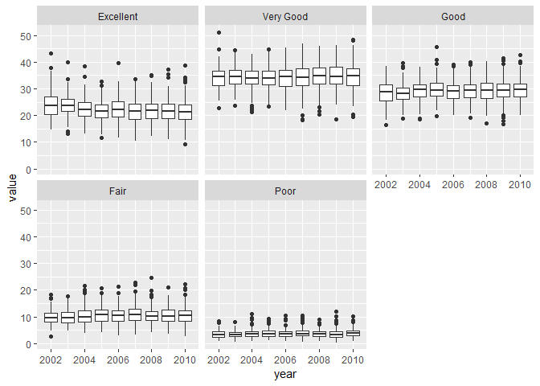

p8105\_hw3\_ks3663
================
Kee-Young Shin
October 10, 2018

Problem 1
---------

``` r
library(tidyverse)
```

    ## -- Attaching packages ---------------------------------------------- tidyverse 1.2.1 --

    ## v ggplot2 3.0.0     v purrr   0.2.5
    ## v tibble  1.4.2     v dplyr   0.7.6
    ## v tidyr   0.8.1     v stringr 1.3.1
    ## v readr   1.1.1     v forcats 0.3.0

    ## -- Conflicts ------------------------------------------------- tidyverse_conflicts() --
    ## x dplyr::filter() masks stats::filter()
    ## x dplyr::lag()    masks stats::lag()

``` r
library(p8105.datasets)

data("brfss_smart2010") 

filtered_brfss = brfss_smart2010 %>%
  janitor::clean_names() %>%
  filter(topic == "Overall Health") %>%
  mutate(response_f = factor(response, levels = c("Excellent", "Very good", "Good", "Fair", "Poor"), ordered = TRUE))

levels(filtered_brfss$response_f)
```

    ## [1] "Excellent" "Very good" "Good"      "Fair"      "Poor"

``` r
filtered_brfss
```

    ## # A tibble: 10,625 x 24
    ##     year locationabbr locationdesc class topic question response
    ##    <int> <chr>        <chr>        <chr> <chr> <chr>    <chr>   
    ##  1  2010 AL           AL - Jeffer~ Heal~ Over~ How is ~ Excelle~
    ##  2  2010 AL           AL - Jeffer~ Heal~ Over~ How is ~ Very go~
    ##  3  2010 AL           AL - Jeffer~ Heal~ Over~ How is ~ Good    
    ##  4  2010 AL           AL - Jeffer~ Heal~ Over~ How is ~ Fair    
    ##  5  2010 AL           AL - Jeffer~ Heal~ Over~ How is ~ Poor    
    ##  6  2010 AL           AL - Mobile~ Heal~ Over~ How is ~ Excelle~
    ##  7  2010 AL           AL - Mobile~ Heal~ Over~ How is ~ Very go~
    ##  8  2010 AL           AL - Mobile~ Heal~ Over~ How is ~ Good    
    ##  9  2010 AL           AL - Mobile~ Heal~ Over~ How is ~ Fair    
    ## 10  2010 AL           AL - Mobile~ Heal~ Over~ How is ~ Poor    
    ## # ... with 10,615 more rows, and 17 more variables: sample_size <int>,
    ## #   data_value <dbl>, confidence_limit_low <dbl>,
    ## #   confidence_limit_high <dbl>, display_order <int>,
    ## #   data_value_unit <chr>, data_value_type <chr>,
    ## #   data_value_footnote_symbol <chr>, data_value_footnote <chr>,
    ## #   data_source <chr>, class_id <chr>, topic_id <chr>, location_id <chr>,
    ## #   question_id <chr>, respid <chr>, geo_location <chr>, response_f <ord>

``` r
class(filtered_brfss$response_f)
```

    ## [1] "ordered" "factor"

``` r
filtered_brfss %>%
  filter(year == "2002") %>%
  select(locationabbr, locationdesc) %>%
  distinct() %>%
  group_by(locationabbr) %>%
  summarize(count = n()) %>%
  filter(count == 7)
```

    ## # A tibble: 3 x 2
    ##   locationabbr count
    ##   <chr>        <int>
    ## 1 CT               7
    ## 2 FL               7
    ## 3 NC               7

``` r
# CT, FL, and NC

spaghetti_data = filtered_brfss %>%
  select(year, locationabbr, locationdesc) %>%
  distinct() %>%
  group_by(year, locationabbr) %>%
  summarize(count = n())
spaghetti_data
```

    ## # A tibble: 443 x 3
    ## # Groups:   year [?]
    ##     year locationabbr count
    ##    <int> <chr>        <int>
    ##  1  2002 AK               1
    ##  2  2002 AL               1
    ##  3  2002 AR               1
    ##  4  2002 AZ               2
    ##  5  2002 CA               1
    ##  6  2002 CO               4
    ##  7  2002 CT               7
    ##  8  2002 DC               1
    ##  9  2002 DE               3
    ## 10  2002 FL               7
    ## # ... with 433 more rows

``` r
ggplot(spaghetti_data, aes(x = year, y = count, color = locationabbr)) + 
  geom_line()
```


``` r
filtered_brfss %>%
  filter(locationabbr == "NY", year %in% c(2002, 2006, 2010)) %>%
  select(locationabbr, locationdesc, year, response_f, sample_size) %>%
  spread(response_f, value = sample_size) %>%
  mutate(proportion_ex = Excellent / (Excellent + `Very good` + Good + Fair + Poor)) %>%
  group_by(year) %>%
  summarize(mean = mean(proportion_ex), std = sd(proportion_ex)) 
```

    ## # A tibble: 3 x 3
    ##    year  mean    std
    ##   <int> <dbl>  <dbl>
    ## 1  2002 0.248 0.0398
    ## 2  2006 0.218 0.0387
    ## 3  2010 0.203 0.0460

``` r
average_data = filtered_brfss %>%
  select(locationabbr, locationdesc, year, response_f, sample_size) %>%
  spread(response_f, value = sample_size) %>%
  mutate(total_sample = (Excellent + `Very good` + Good + Fair + Poor)) %>%
  mutate(proportion_ex = Excellent / total_sample, proportion_vg = `Very good` / total_sample, proportion_g = Good / total_sample, proportion_f = Fair / total_sample, proportion_p = Poor / total_sample) %>%
  group_by(year, locationabbr) %>%
  summarize(mean_ex = mean(proportion_ex), mean_vg = mean(proportion_vg), mean_g = mean(proportion_g), mean_f = mean(proportion_f), mean_p = mean(proportion_p)) %>%
  ungroup() %>%
  gather(key = variable, value = value, 3:7)

average_data
```

    ## # A tibble: 2,215 x 4
    ##     year locationabbr variable value
    ##    <int> <chr>        <chr>    <dbl>
    ##  1  2002 AK           mean_ex  0.279
    ##  2  2002 AL           mean_ex  0.187
    ##  3  2002 AR           mean_ex  0.237
    ##  4  2002 AZ           mean_ex  0.238
    ##  5  2002 CA           mean_ex  0.250
    ##  6  2002 CO           mean_ex  0.227
    ##  7  2002 CT           mean_ex  0.283
    ##  8  2002 DC           mean_ex  0.313
    ##  9  2002 DE           mean_ex  0.206
    ## 10  2002 FL           mean_ex  0.258
    ## # ... with 2,205 more rows

``` r
ggplot(average_data, aes(x = year, y = value, color = locationabbr)) + 
  geom_line() + facet_wrap(~variable)
```



Problem 2
---------

``` r
data("instacart")

cart_data = instacart

cart_data
```

    ## # A tibble: 1,384,617 x 15
    ##    order_id product_id add_to_cart_ord~ reordered user_id eval_set
    ##       <int>      <int>            <int>     <int>   <int> <chr>   
    ##  1        1      49302                1         1  112108 train   
    ##  2        1      11109                2         1  112108 train   
    ##  3        1      10246                3         0  112108 train   
    ##  4        1      49683                4         0  112108 train   
    ##  5        1      43633                5         1  112108 train   
    ##  6        1      13176                6         0  112108 train   
    ##  7        1      47209                7         0  112108 train   
    ##  8        1      22035                8         1  112108 train   
    ##  9       36      39612                1         0   79431 train   
    ## 10       36      19660                2         1   79431 train   
    ## # ... with 1,384,607 more rows, and 9 more variables: order_number <int>,
    ## #   order_dow <int>, order_hour_of_day <int>,
    ## #   days_since_prior_order <int>, product_name <chr>, aisle_id <int>,
    ## #   department_id <int>, aisle <chr>, department <chr>

``` r
dim(cart_data)
```

    ## [1] 1384617      15

There are

``` r
distinct(instacart, aisle_id) 
```

    ## # A tibble: 134 x 1
    ##    aisle_id
    ##       <int>
    ##  1      120
    ##  2      108
    ##  3       83
    ##  4       95
    ##  5       24
    ##  6       21
    ##  7        2
    ##  8      115
    ##  9       53
    ## 10      123
    ## # ... with 124 more rows

``` r
# There are 134 different aisles. 

instacart %>%
  group_by(aisle_id) %>% # group by aisle id
  summarize(n = n()) %>% # take count of number of times ordered 
  arrange(-n) # puts the aisle id in order from most ordered to least
```

    ## # A tibble: 134 x 2
    ##    aisle_id      n
    ##       <int>  <int>
    ##  1       83 150609
    ##  2       24 150473
    ##  3      123  78493
    ##  4      120  55240
    ##  5       21  41699
    ##  6      115  36617
    ##  7       84  32644
    ##  8      107  31269
    ##  9       91  26240
    ## 10      112  23635
    ## # ... with 124 more rows

``` r
# Most items are ordered from aisle 83 and aisle 24. 


aisle_data = instacart %>%
  group_by(aisle_id) %>% # group by aisle id
  summarize(n = n())  # take count of number of times ordered 
  
aisle_data
```

    ## # A tibble: 134 x 2
    ##    aisle_id     n
    ##       <int> <int>
    ##  1        1  2936
    ##  2        2  3873
    ##  3        3 17449
    ##  4        4  9917
    ##  5        5  2905
    ##  6        6  1795
    ##  7        7  1526
    ##  8        8  1501
    ##  9        9  9736
    ## 10       10   448
    ## # ... with 124 more rows

``` r
ggplot(aisle_data, aes(x = aisle_id, y = n)) + geom_point()
```


``` r
instacart %>%
  filter(aisle %in% c("dog food care", "baking ingredients", "packaged vegetables fruits")) %>%
  group_by(product_name, aisle) %>%
  summarize(count = n()) %>%
  ungroup() %>%
  group_by(aisle) %>%
  arrange(desc(count)) %>%
  slice(1)
```

    ## # A tibble: 3 x 3
    ## # Groups:   aisle [3]
    ##   product_name                               aisle                   count
    ##   <chr>                                      <chr>                   <int>
    ## 1 Light Brown Sugar                          baking ingredients        499
    ## 2 Snack Sticks Chicken & Rice Recipe Dog Tr~ dog food care              30
    ## 3 Organic Baby Spinach                       packaged vegetables fr~  9784

``` r
instacart %>%
  filter(product_name %in% c("Pink Lady Apples", "Coffee Ice Cream")) %>%
  group_by(product_name, order_dow) %>%
  summarize(mean_hour = mean(order_hour_of_day)) %>%
  spread(order_dow, mean_hour)
```

    ## # A tibble: 2 x 8
    ## # Groups:   product_name [2]
    ##   product_name       `0`   `1`   `2`   `3`   `4`   `5`   `6`
    ##   <chr>            <dbl> <dbl> <dbl> <dbl> <dbl> <dbl> <dbl>
    ## 1 Coffee Ice Cream  13.8  14.3  15.4  15.3  15.2  12.3  13.8
    ## 2 Pink Lady Apples  13.4  11.4  11.7  14.2  11.6  12.8  11.9
